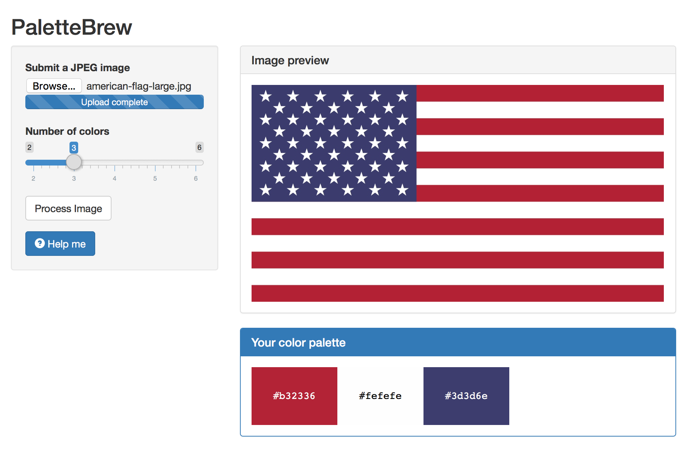

## What is PaletteBrew? {.flexbox .vcenter}

- **PaletteBrew** is an app that generates a color palette from a given image.

<div id="main-screenshot">

</div>
```{r}

```


## Why PaletteBrew?

- Creating a color palette for web, print or application design is often a hard
  problem.
- **PaletteBrew** helps by extracting a color palette from an existing image.
- Draw upon the wisdom of masters of painting such as [Vincent van Gogh] or
  [Edward Hopper] by learning from their color selections.


## How does PaletteBrew work?

- First **PaletteBrew** loads the RGB values of all pixels in the image as a
  dataset.
- Then it performs [*k*-means clustering] on the RGB values with *k* set to
  the number of colors specified by the user.
- Then it takes the centers of the resulting clusters as the color palette, and
  uses the [`palettewidget`] HTML widget [^1] to display them.
- `palettewidget` was written specifically for **PaletteBrew**.


## Example

- Image: [Edward Hopper's *Nighthawks*]

<div id="nighthawks">

</div>

```{r, echo=FALSE}
library(jpeg)
library(palettewidget)
source("code/cluster.R")

set.seed(65)

nighthawks <- as.raster(readJPEG("img/nighthawks.jpg"))
clusters <- computeClusters(nighthawks, 5)
palette <- getPalette(clusters)

palettewidget(palette)
```

[Vincent van Gogh]: https://en.wikipedia.org/wiki/Vincent_van_Gogh
[Edward Hopper]: https://en.wikipedia.org/wiki/Edward_Hopper
[*k*-means clustering]: https://en.wikipedia.org/wiki/K-means_clustering
[`palettewidget`]: https://github.com/sigriston/palettewidget
[Edward Hopper's *Nighthawks*]: https://en.wikipedia.org/wiki/Edward_Hopper#/media/File:Nighthawks_by_Edward_Hopper_1942.jpg
